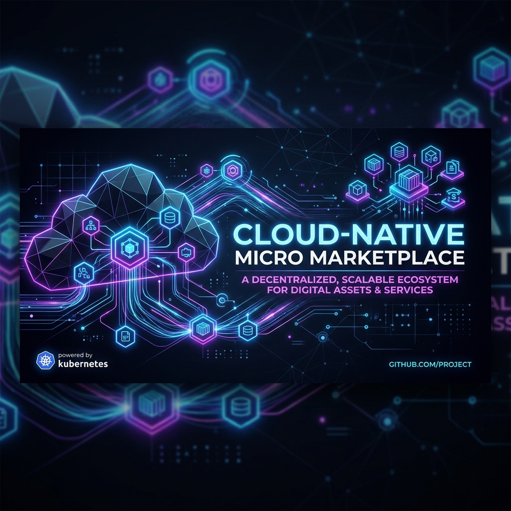

<div align="center">
  
  
# 🛒 Cloud-Native Micro Marketplace
**A Production-Ready, Event-Driven E-Commerce Platform**

[](https://github.com/indrajithas673/cloud-native-ecommerce/actions/workflows/ci.yml)
[](https://www.oracle.com/java/technologies/javase/jdk17-archive-downloads.html)
[](https://spring.io/projects/spring-boot)
[](https://k3s.io/)
[](https://aws.amazon.com/)
[](https://www.terraform.io/)

*Designed for extreme scalability, fault tolerance, and comprehensive observability.*

</div>

---

## 📖 Project Overview

**Micro Marketplace** is a comprehensive, production-ready e-commerce system built from the ground up using a modern microservices architecture. It demonstrates advanced cloud-native patterns including **Event-Driven Architecture (EDA)**, **Circuit Breaking**, **Distributed Tracing**, and **Infrastructure as Code (IaC)**.

The system securely processes orders, tracks inventory, and emits asynchronous notifications—all deployed automatically to an AWS Kubernetes cluster via an OIDC-federated GitHub Actions pipeline.

---

## ✨ Key Capabilities

- 🏗️ **Domain-Driven Design**: Strictly segregated microservices (Product, Order, Inventory, Notification).
- 🛡️ **Edge Security**: Centralized API Gateway with OAuth2 & Keycloak JWT validation.
- ⚡ **Asynchronous Messaging**: KRaft-mode Apache Kafka for resilient, decoupled inter-service communication.
- 📈 **Full Observability Stack**: End-to-end distributed tracing via Zipkin, with metrics aggregated in Prometheus and visualized in Grafana.
- 🛡️ **Graceful Degradation**: Resilience4j circuit breakers prevent cascading failures during downstream outages.
- ☁️ **Cloud-Native Deployment**: AWS EC2 K3s Cluster, Amazon RDS, and AWS OIDC integration.
- 🚀 **Zero-Touch CI/CD**: Automated deployment pipeline using GitHub Actions, Jib, and Kustomize.

---

## 🛠️ Technology Stack

| Category | Technologies Used |
| :--- | :--- |
| **Core Framework** | `Java 17`, `Spring Boot 3.x`, `Spring Cloud` |
| **API Gateway** | `Spring Cloud Gateway` |
| **Identity & Security** | `Keycloak`, `OAuth2`, `JWT` |
| **Data Persistence** | `Amazon RDS (MySQL 8.4)`, `Spring Data JPA` |
| **Event Streaming** | `Apache Kafka (KRaft mode)` |
| **Resilience** | `Resilience4j` (Circuit Breakers, Timeouts, Retry) |
| **Observability** | `Micrometer`, `Zipkin`, `Prometheus`, `Grafana` |
| **Infrastructure (IaC)**| `Terraform`, `AWS EC2`, `K3s`, `Kubernetes (Kustomize)` |
| **CI/CD Pipeline** | `GitHub Actions`, `Amazon ECR`, `AWS OIDC` |

---

## 🏗️ High-Level Architecture

The architecture enforces strict separation of concerns, ensuring high availability and secure request routing.

<div align="center">
  
</div>

> 🔍 **Deep Dive:** Explore the full request flow, Kafka event topologies, and Keycloak authentication sequences in the [System Architecture Document](docs/ARCHITECTURE.md).

---

## 📚 Comprehensive Documentation

The repository is thoroughly documented to assist with onboarding, architectural review, and operational troubleshooting.

| Documentation Area | Description | Link |
| :--- | :--- | :--- |
| **System Design** | Detailed diagrams and microservice responsibilities. | [ARCHITECTURE.md](docs/ARCHITECTURE.md) |
| **Infrastructure & CI/CD** | Terraform AWS setup, K3s cluster, and GitHub Actions. | [DEPLOYMENT.md](docs/DEPLOYMENT.md) |
| **REST API Reference** | Complete endpoint payloads, Auth requirements, and examples. | [API.md](docs/API.md) |
| **Security Architecture**| Keycloak integration, AWS OIDC, and K8s secret management. | [SECURITY.md](docs/SECURITY.md) |
| **Local Development** | Docker-compose setup, environment variables, and Jib builds. | [DEVELOPMENT.md](docs/DEVELOPMENT.md) |
| **Troubleshooting Guide**| Verified resolutions for `CrashLoopBackOff`, Kafka, and RDS. | [TROUBLESHOOTING.md](docs/TROUBLESHOOTING.md) |
| **Quality Audit** | Verification of repository cleanliness and standards. | [REPOSITORY_AUDIT.md](docs/REPOSITORY_AUDIT.md) |
| **Release History** | Version logs and feature enhancements. | [CHANGELOG.md](CHANGELOG.md) |

---

## 🚀 Quick Start (Local Setup)

Want to spin up the entire microservices ecosystem locally? 

1. **Clone & Configure**
   ```bash
   git clone https://github.com/indrajithas673/cloud-native-ecommerce.git
   cd cloud-native-ecommerce
   cp .env.example .env
   ```
2. **Launch Infrastructure & Services**
   ```bash
   docker-compose up -d
   ```
3. **Access the Application**
   - **API Gateway**: `http://api.127.0.0.1.nip.io`
   - **Keycloak Admin**: `http://localhost:8080`
   - **Zipkin Tracing**: `http://localhost:9411`
   - **Grafana Dashboards**: `http://localhost:3000`

> 📖 See [DEVELOPMENT.md](docs/DEVELOPMENT.md) for full instructions on building Docker images, configuring Keycloak, and running end-to-end tests locally.

---
<div align="center">
  <i>Developed and maintained for demonstration of advanced Cloud-Native engineering principles.</i>
</div>
