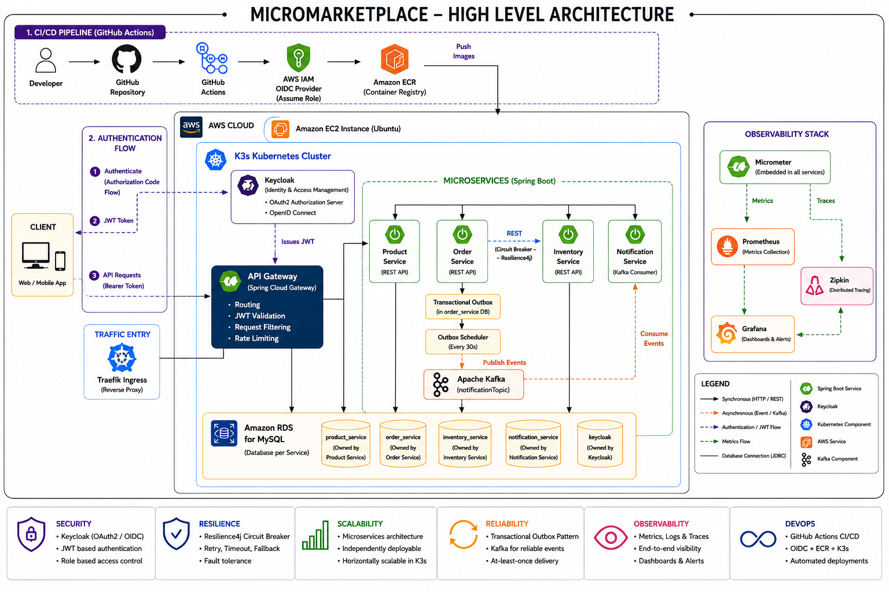
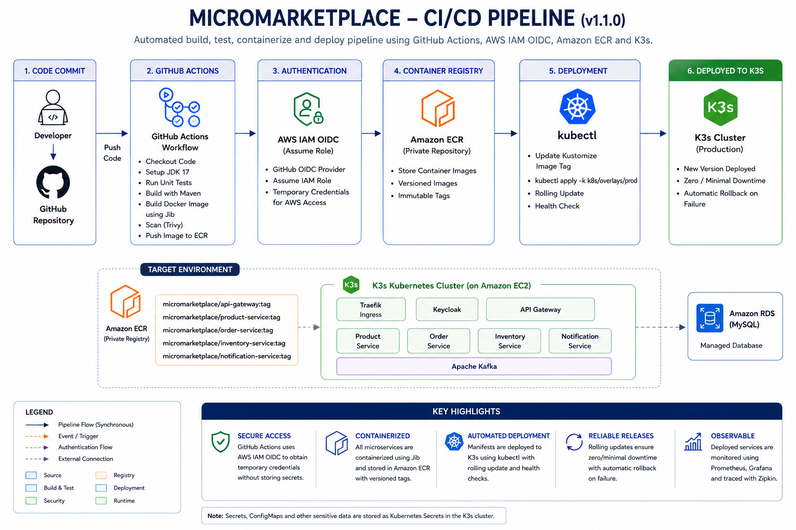
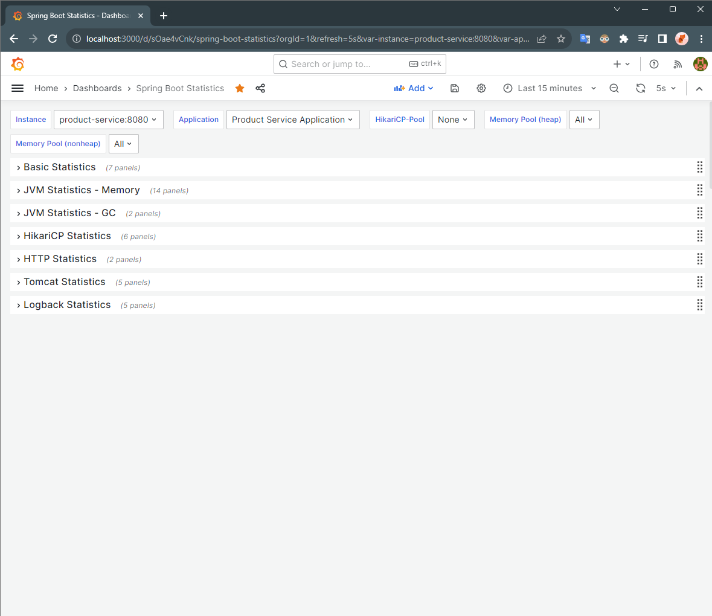
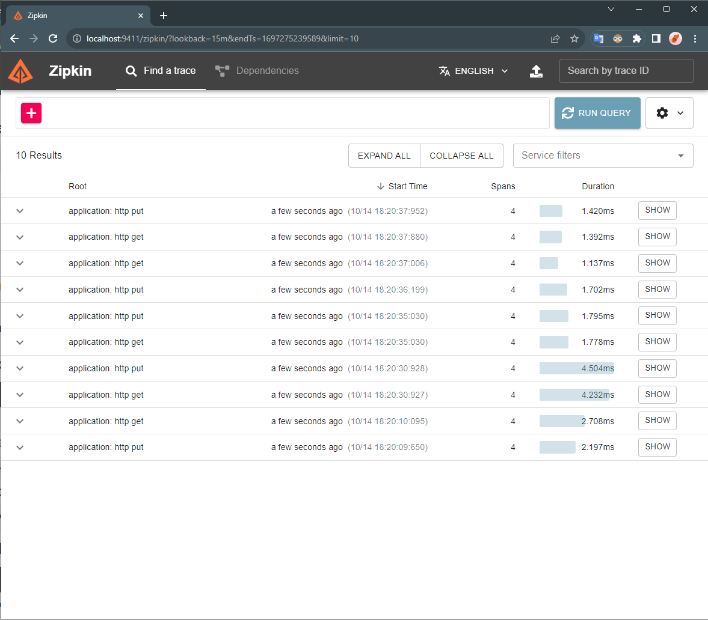

<div align="center"> 
  # 🛒 Cloud-Native E-Commerce Platform
  
  **Event-driven e-commerce backend built using Spring Boot, Kafka, Kubernetes, Terraform, and AWS.**

  [](https://github.com/indrajithas673/cloud-native-ecommerce/actions/workflows/ci.yml)
  [](https://www.oracle.com/java/technologies/javase/jdk17-archive-downloads.html)
  [](https://spring.io/projects/spring-boot)
  [](https://kafka.apache.org/)
  [](https://k3s.io/)
  [](https://aws.amazon.com/)
</div>

## 🚦 Project Status

- ✅ Cloud deployment completed on AWS
- ✅ Kubernetes deployment automated using GitHub Actions
- ✅ Infrastructure provisioned using Terraform
- ✅ Event-driven microservices using Apache Kafka

---

## 🌟 Why This Project Stands Out

- **Event-Driven Architecture**: Decoupled services using Apache Kafka.
- **Transactional Outbox**: Improved data consistency across distributed databases.
- **Circuit Breakers**: Prevented cascading system failures using Resilience4j.
- **Kubernetes**: Orchestrated containers with K3s for automatic healing and secrets management.
- **Terraform**: Codified 100% of the AWS infrastructure.
- **GitHub Actions**: Fully automated CI/CD pipeline from commit to deployment.
- **AWS OIDC**: Secured deployments without long-lived IAM keys.
- **Keycloak**: Centralized OAuth2/JWT security at the API Gateway layer.

---

## 📊 Project Metrics

> 5 Spring Boot Microservices | 1 API Gateway | Apache Kafka | Amazon RDS | Kubernetes (K3s) | Terraform Infrastructure | GitHub Actions CI/CD | OAuth2 Authentication | Event-driven Communication | Distributed Tracing

This project focuses on distributed system design, secure cloud deployment, Infrastructure as Code, and automated CI/CD using modern backend engineering practices.

---

## 🏛️ System Architecture

<div align="center">
  
</div>

### Request Flow
1. Client sends a request to the API Gateway.
2. API Gateway validates the JWT using Keycloak.
3. Request is routed to the target microservice.
4. Business data is stored in Amazon RDS.
5. Order Service publishes an event to Kafka.
6. Notification Service consumes the event asynchronously.

---

## 💡 Engineering Decisions

**Transactional Outbox**  
*Problem:* Saving an order to a database and publishing an event to Kafka are distinct operations. If Kafka crashes immediately after the database saves, the event is permanently lost (the Dual-Write problem).  
*Solution:* Save the Order entity and an Outbox event entity in the same atomic database transaction. A separate scheduler polls the Outbox table and publishes to Kafka.  
*Benefit:* Improves reliability by storing the business data and the event within the same database transaction before asynchronous publication.

**Circuit Breaker**  
*Problem:* If the Inventory Service goes down, the Order Service could run out of threads waiting for a response, causing the entire system to crash.  
*Solution:* Implement Resilience4j to fail fast after a timeout and return a clean fallback response ("Inventory service is currently unavailable").  
*Benefit:* Preserves overall system stability and prevents cascading failures.

**Kafka**  
*Problem:* Synchronous HTTP calls between all services create tight coupling and slow response times.  
*Solution:* Use Apache Kafka to decouple the critical path (placing an order) from non-critical tasks (sending emails).  
*Benefit:* Allows the Notification Service to process events asynchronously or catch up if it restarts without impacting user checkout speed.

**Terraform**  
*Problem:* Provisioning cloud infrastructure manually via a UI is slow, error-prone, and difficult to reproduce.  
*Solution:* Codify the AWS VPC, Subnets, EC2 instance, Security Groups, and Amazon RDS instance using Terraform.  
*Benefit:* Helps ensure the entire infrastructure is version-controlled and can be destroyed or recreated with a single command.

**GitHub Actions + AWS OIDC**  
*Problem:* Storing long-lived AWS IAM access keys in GitHub Secrets is a major security risk if compromised.  
*Solution:* Configure OpenID Connect (OIDC) between GitHub and AWS.  
*Benefit:* GitHub Actions assumes a strictly scoped, temporary IAM role just in time for deployment, helping eliminate the need for hardcoded credentials.

**Kubernetes (K3s)**  
*Problem:* Managing raw Docker containers manually on an EC2 instance makes updates and secrets management difficult. AWS EKS is too expensive for a learning project.  
*Solution:* Deploy K3s, a lightweight, CNCF-certified Kubernetes distribution, directly onto the EC2 instance.  
*Benefit:* Provides the full power of Kubernetes (Deployments, Services, automated restarts) without the heavy cloud bill.

---

## 🛠️ Technology Stack

| Category | Technology |
| :--- | :--- |
| **Backend** | Java 17, Spring Boot 3.1, Spring Cloud Gateway |
| **Security** | Keycloak, OAuth2, JWT |
| **Messaging** | Apache Kafka (KRaft mode) |
| **Database** | Amazon RDS (MySQL 8.0), Spring Data JPA, Flyway |
| **Cloud** | AWS (EC2, RDS, VPC, ECR, IAM) |
| **Infrastructure** | Terraform, Kubernetes (K3s) |
| **DevOps** | GitHub Actions, AWS OIDC, Jib, Kustomize |
| **Monitoring** | Micrometer, Zipkin, Prometheus, Grafana |

---

## 📁 Repository Structure

```text
.
├── api-gateway/           # Spring Cloud Gateway handling routing and OAuth2 validation
├── product-service/       # Microservice managing the product catalog
├── order-service/         # Core microservice managing orders and Outbox publishing
├── inventory-service/     # Microservice managing stock levels atomically
├── notification-service/  # Kafka consumer that processes asynchronous events
├── terraform/             # IaC files provisioning the AWS environment
├── k8s/                   # Kubernetes manifests managed with Kustomize
├── docs/                  # Architecture diagrams and deep-dive documentation
└── .github/               # GitHub Actions CI/CD pipeline definitions
```

---

## ⚙️ System Design Highlights
- **API Gateway Pattern**: Single entry point handling cross-cutting concerns like security.
- **Event-Driven Architecture**: Asynchronous communication for non-critical paths.
- **Transactional Outbox**: Atomic database operations to prevent message loss.
- **Circuit Breaker**: Fault tolerance for synchronous inter-service calls.
- **Infrastructure as Code**: Declarative cloud resource provisioning.
- **OAuth2 Security**: Centralized identity management via Keycloak.
- **Container Orchestration**: Declarative deployment and self-healing pods.

---

## 🚀 Features
- Centralized API routing with JWT validation.
- Synchronous inter-service communication with fallback mechanisms.
- Asynchronous messaging for email notifications.
- Reliable event publishing without dual-write inconsistencies.
- Distributed tracing across HTTP and messaging boundaries.
- Fully automated IaC provisioning.
- Automated CI/CD pipeline from commit to deployment.

---

## 🔄 CI/CD Pipeline

<div align="center">
  
</div>

- Build and test the application.
- Build optimized container images using Google Jib (builds directly from Maven without requiring Dockerfiles).
- Push images to Amazon ECR.
- Deploy updated workloads to Kubernetes using Kustomize (manages environment-specific configuration without duplicating manifests).

---

## 📊 Observability

Because distributed systems are difficult to debug, every request is tagged with a trace ID that flows through the Gateway, into the internal services, and across Kafka.

<div align="center">
  
  
</div>

---

## ⚡ Quick Start

```bash
git clone https://github.com/indrajithas673/cloud-native-ecommerce.git
cd cloud-native-ecommerce

# Start the backing infrastructure (MySQL, Kafka, Keycloak, Zipkin, Prometheus)
docker-compose up -d

# Start a service locally
cd product-service
./mvnw spring-boot:run
```
*For detailed setup, see the [Local Development Setup](docs/DEVELOPMENT.md).*

---

## 📚 Documentation
- 📐 [System Architecture](docs/ARCHITECTURE.md)
- ☁️ [Infrastructure & Deployment Guide](docs/DEPLOYMENT.md)
- 🛡️ [Security & IAM Guide](docs/SECURITY.md)
- 🔌 [API Reference](docs/API.md)
- 💻 [Local Development Setup](docs/DEVELOPMENT.md)

---

## 🎓 Why I Built This

I built this project as a final-year engineering student to transition from writing basic CRUD applications to understanding how large-scale, distributed systems actually operate in the real world. 

I wanted to move beyond tutorials and get hands-on experience solving the hard problems: ensuring data doesn't get lost between microservices, keeping the system alive when a downstream service crashes, writing infrastructure as code, and fully automating the deployment process using modern CI/CD security practices.

---

## 🧠 Lessons Learned
- **Handling Partial Failures:** In a distributed system, network calls will eventually fail. Implementing circuit breakers taught me that failing fast gracefully is much better than waiting and crashing the whole system.
- **Data Consistency is Hard:** Realizing that saving to a database and sending a Kafka message isn't atomic opened my eyes to the dual-write problem. Implementing the Transactional Outbox pattern was a major lightbulb moment.
- **Startup Dependencies:** Kubernetes will aggressively restart containers if they fail their liveness probes. I learned the hard way that applications must be configured to patiently wait for databases to initialize before accepting traffic.
- **Automation Pays Off:** Spending the time to write Terraform scripts and GitHub Actions workflows felt slow at first, but it saved me countless hours of manual debugging and server configuration later on.

---

## 🔮 Future Improvements
- Horizontal Pod Autoscaling (HPA) for services based on CPU load.
- Multi-node Kubernetes cluster.
- Centralized logging stack (EFK) to aggregate logs from all pods.
- Implement an automated performance testing suite (e.g., Gatling or JMeter).
