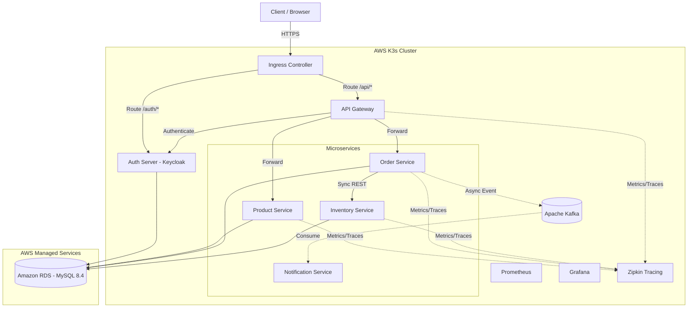
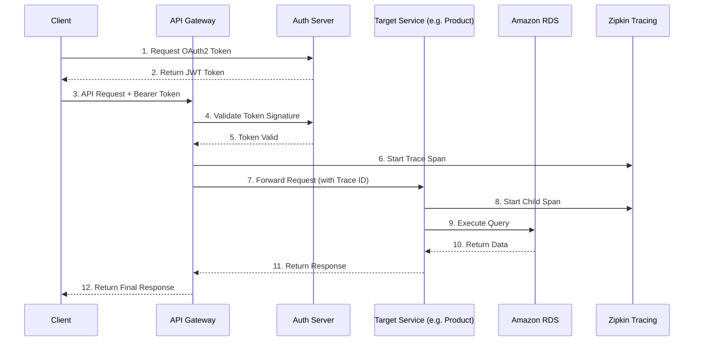
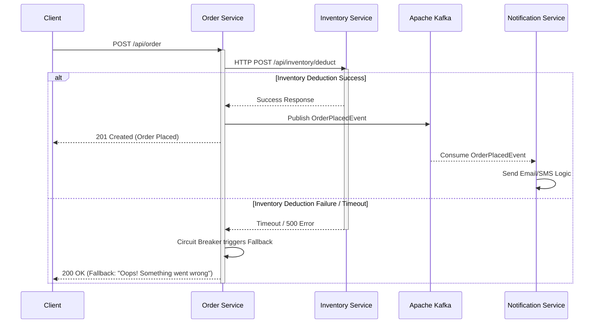
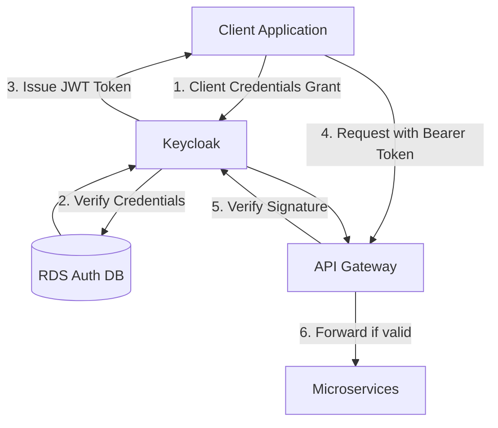

# Architecture Overview

## 1. System Architecture

The following diagram illustrates the overarching system architecture, displaying the internal communication between Spring Boot microservices, infrastructure boundaries, and the external Gateway.

## 2. Request Flow

This diagram details the sequence of a typical API request as it traverses the API Gateway, retrieves authorization, and traces execution across downstream microservices.

## 3. Order Processing Flow

The Order processing flow involves synchronous interaction for inventory deduction and asynchronous messaging for notification delivery. It utilizes Circuit Breaker resilience to handle downstream service failures gracefully.

## 4. Authentication Flow (Keycloak)

