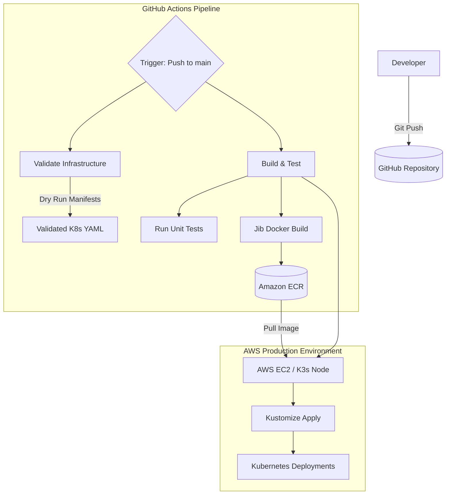
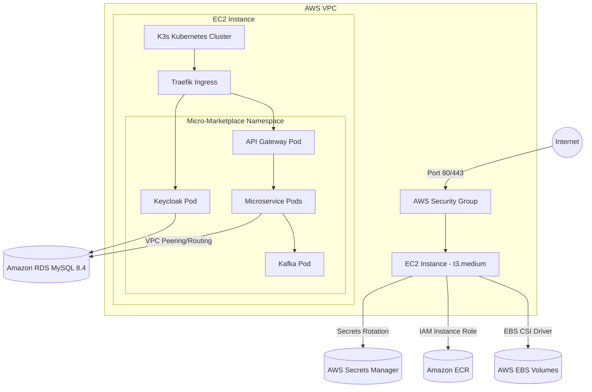

# Deployment Overview

## 1. CI/CD Pipeline

Micro Marketplace uses GitHub Actions for an automated CI/CD pipeline targeting AWS K3s. 

## 2. AWS + K3s Deployment Architecture

The application is hosted on a single Amazon EC2 instance running the K3s Kubernetes distribution. Storage, secrets, and image registry are integrated natively with AWS managed services.

